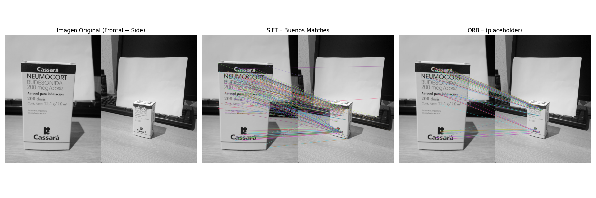
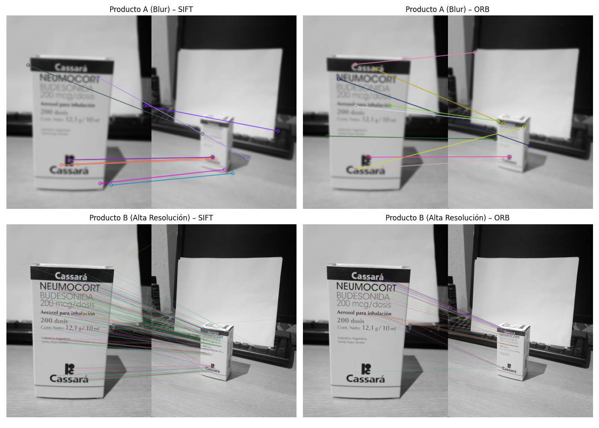

# LABORATORIO 3

- Mathew Alexander Cordero Aquino - 22982
- Gustavo Adolfo Cruz Bardales - 22779

[REPOSITORIO](https://github.com/donmatthiuz/VIC/tree/lab3)

# Task 1

Usted deberá demostrar comprensión teórica del criterio de Harris sin usar librerías. Para ello considere lo siguiente.
Se te da la siguiente Matriz del Segundo Momento (Tensor de Estructura) M calculada en un píxel específico (u,v) de una imagen:
$$M = \begin{pmatrix} 120 & 5 \\ 5 & 115 \end{pmatrix}$$
Y una segunda matriz M' para otro píxel diferente:
$$M' = \begin{pmatrix} 200 & 10 \\ 10 & 1 \end{pmatrix}$$
Con esta información haga lo siguiente:

1. Calcule manualmente (muestra tu procedimiento) los Eigenvalores ($\lambda_1$, $\lambda_2$) para ambas matrices.
2. Calcule la Respuesta de Harris (R) para ambas matrices usando la fórmula vista en clase. Asuma k = 0.04
3. Basado en tus resultados numéricos, clasifica qué representa cada píxel geométricamente: ¿Es una Esquina, un Borde o una Región Plana? Justifica tu respuesta usando las definiciones de eigenvalores vistas en clase

## Cálculo de Eigenvalores y Respuesta de Harris

### Eigenvalores
Para una matriz $M = \begin{pmatrix} a & b \\ b & c \end{pmatrix}$, los eigenvalores se obtienen resolviendo:
$$\det(M - \lambda I) = 0 \implies (a - \lambda)(c - \lambda) - b^2 = 0$$

#### Para $M = \begin{pmatrix} 120 & 5 \\ 5 & 115 \end{pmatrix}$:

$$(120 - \lambda)(115 - \lambda) - 25 = 0$$
$$\lambda^2 - 235\lambda + 13800 - 25 = 0$$
$$\lambda^2 - 235\lambda + 13775 = 0$$
$$\lambda = \frac{235 \pm \sqrt{235^2 - 4 \cdot 13775}}{2}$$
$$\lambda = \frac{235 \pm \sqrt{55225 - 55100}}{2}$$
$$\lambda = \frac{235 \pm \sqrt{125}}{2} = \frac{235 \pm 5\sqrt{5}}{2}$$
$$\boxed{\lambda_1 = \frac{235 + 5\sqrt{5}}{2} \approx 123.09}$$
$$\boxed{\lambda_2 = \frac{235 - 5\sqrt{5}}{2} \approx 111.91}$$

#### Para $M' = \begin{pmatrix} 200 & 10 \\ 10 & 1 \end{pmatrix}$:

$$(200 - \lambda)(1 - \lambda) - 100 = 0$$
$$\lambda^2 - 201\lambda + 200 - 100 = 0$$
$$\lambda^2 - 201\lambda + 100 = 0$$
$$\lambda = \frac{201 \pm \sqrt{201^2 - 4 \cdot 100}}{2}$$
$$\lambda = \frac{201 \pm \sqrt{40401 - 400}}{2}$$
$$\lambda = \frac{201 \pm \sqrt{40001}}{2} \approx \frac{201 \pm 200.00125}{2}$$
$$\boxed{\lambda_1 \approx 200.50}$$
$$\boxed{\lambda_2 \approx 0.50}$$

### Harris (R)

#### Para $M$:

$$\det(M) = 120 \cdot 115 - 5 \cdot 5 = 13775$$
$$\text{tr}(M) = 120 + 115 = 235$$
$$R = 13775 - 0.04 \cdot (235)^2 = 13775 - 2209 = \boxed{11566}$$

#### Para $M'$:
$$\det(M') = 200 \cdot 1 - 10 \cdot 10 = 100$$
$$\text{tr}(M') = 200 + 1 = 201$$
$$R' = 100 - 0.04 \cdot (201)^2 = 100 - 1616.04 = \boxed{-1516.04}$$

### Clasificación Geométrica

#### Criterios de Clasificación
Según el criterio de Harris, la clasificación se basa en los eigenvalores:
- Esquina: $\lambda_1 \gg 0$ y $\lambda_2 \gg 0$ (ambos grandes) $\rightarrow$ R > 0
- Borde: $\lambda_1 \gg \lambda_2 \approx 0$ (uno grande, otro pequeño) $\rightarrow$ R < 0
- Región Plana: $\lambda_1 \approx 0$ y $\lambda_2 \approx 0$ (ambos pequeños) $\rightarrow$ R $\approx$ 0

#### Para M:

Eigenvalores: $\lambda_1 \approx 123.09$, $\lambda_2 \approx 111.91$

Respuesta de Harris: R = 11566

Clasificación: esquina 

Justificación: Ambos eigenvalores son grandes (>100) y similares entre sí ($\lambda_1/\lambda_2 \approx 1.10$). La respuesta R es positiva y muy grande. Esto indica variaciones significativas de intensidad en todas las direcciones, característico de una esquina donde convergen dos bordes.

#### Para M':

Eigenvalores: $\lambda_1 \approx 200.50$, $\lambda_2 \approx 0.50$

Respuesta de Harris: R' = -1516.04

Clasificación: borde 

Justificación: Un eigenvalor es muy grande ($\lambda_1 \approx 200.50$) mientras el otro es muy pequeño ($\lambda_2 \approx 0.50$), con una relación $\lambda_1/\lambda_2 \approx 401$. La respuesta R es negativa. Esto es una variación fuerte en una única dirección y prácticamente nula en la dirección perpendicular, y como lo vimos, es característico de un borde.

# Task 2

# Task 3

## Escenarios

- Para el producto A se quito el 75% de los pixeles y se aplico un filtro gaussiano para simular lo borroso y baja calidad de las imagenes de los drones.

- Para el producto B se le hizo un rescalado haciendola mas grande el 200% porque las imagenes de las grieta seran mas limpias y grandes. Ademas que la interpolación cubica mejoro la imagen dandole suavizado y mejor calidad.

## Resultados

### Tabla de Tiempos Promedios

| Escenario | Algoritmo | Tiempo (ms) | KP Img A | KP Img B | Matches |
|-----------|-----------|-------------|----------|----------|---------|
| A (Blur)  | SIFT      | 31.52       | 152      | 65       | 9       |
| A (Blur)  | ORB       | 15.58       | 626      | 218      | 9       |
| B (4K)    | SIFT      | 1470.94     | 1641     | 3328     | 327     |
| B (4K)    | ORB       | 76.54       | 1500     | 1500    | 59      |

### Analisis Critico

- ¿Cuál algoritmo elegiría para el Producto A (Drone de Carreras) y por qué? Base su
respuesta en los milisegundos que mediste y la tasa de refresco requerida (60 FPS = 16ms
de presupuesto total).

    Viendo este escenario el que elegiriamos es ORB , ya que si vemos la cantidad de milisegundos que se tarda es de 15 siendo el solicitado de 16 ms , aun asi cabe recalcar que el que mejor desempeño tuvo fue SIFT, ya que para este el blur le favorece bastante, aun asi los matches como se pueden ver son iguales asi que se da por concluido que el mejor en el **producto A** es **ORB**.

- ¿Cuál algoritmo elegirías para el Producto B (Inspección) y por qué? Analice la calidad
    visual de los matches en los cambios de escala y rotación que probaste. ¿Falló ORB en
    algún caso donde SIFT tuvo éxito?

    Si de hecho **SIFT** seria el que se elegiria aqui, debido a que si se ve los matches tenemos 327 a diferencia de ORB que tiene 59, si bien ORB es bueno en velocidad en detección no lo es ya que SIFT, ya que es invariante a escala, rotacion y tamaño, lo que lo hace que en casos en donde tengan alta definicion y alto detalle sea mucho mejor. 

- ¿Las conclusiones que estamos alcanzando son justas y generalizables? ¿Por qué? ¿Qué
deberíamos considerar en futuras iteraciones?

    Las conclusiones son que SIFT se usaria para el producto B ya que detecta mejor detalles y que ORB se usa para el producto A ya que es mas rapido. 
    Debido a esto si son justas ya que se esta usando las caracteristicas de cada algoritmo, la rapidez de ORB y el ver detalles con SIFT, 

    Aun asi no son generalizables ya que depende mucho de la resolucion , iluminación , movimiento y hardware que se tenga. 

    Lo que se recomienda en futuras iteraciones es lo siguiente
    
    - Aumentar la muestras
    - Evaluar desempeño en hardware
    - Tener mas algoritmos
    - Evaluar estabilidad entre frames
    - Evaluar pros y contras entre velocidad, rendimiento , uso de recursos y presición